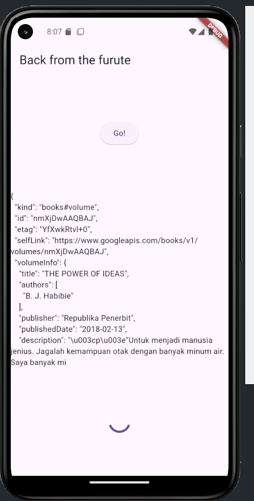

# Pertemuan 12 

## Praktikum 1
1. Buat project baru

2. Cek di pusbspec.yaml

3. buka file main.dart

4. Tambah method getData()

## Praktikum 2
1. Buka file main.dart

2. Tambah method count()

3. Panggil count()

4. Run 

## Praktikum 3
1. buka main.dart

2. tambahkan variabel dan method

3. Ganti isi kode onPressed()

4. Run

5. Ganti method calculate()

6. pindah ke onPressed()
