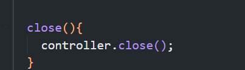
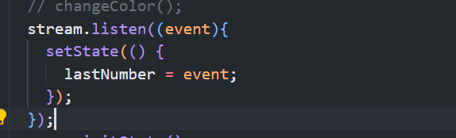
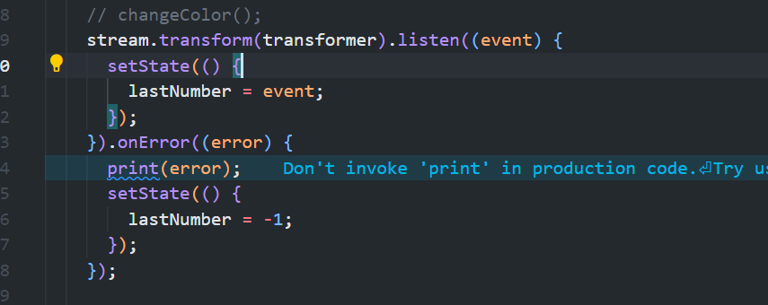

# Pertemuan 13

## Praktikum 1

1. Buka file main.dart
   
2. Buat file baru stream.dart
   
3. Buat variabel colors
   
4. Tambahkan method getColors()
   
5. Tambah perintah yield\*
   
6. Buka main.dart
   
7. Tambah variabel
   
8. tambahkan method changeColor
   
9. Lakukan override
   
10. Ubah isi scaffold()
    

## Praktikum 2

1. Buka file Stream.dart
   
2. Tambah class NumberStream
   
3. Tambah StreamController
   
4. Tambah method addNumberToSink
   
5. Tambah method Close()
   
6. buka main.dart
   
7. Tambah variabel
   
8. Edit initState()
   
9. Edit dispose()
   
10. Tambah method addRandomNumber()
    
11. Edit method build
    
12. run
13. buka stream.dart
    
14. Buka main.dart
    
15. Edit method addRandomNumber()
    

## Praktikum 3

1. buka main.dart
   
2. Tambahkan kode ini di initstate
   
3. Tetap di initState
   
4. Run

## Soal 1

- Tambahkan nama panggilan Anda pada title app sebagai identitas hasil pekerjaan Anda.
  

## Soal 2

- Tambahkan 5 warna lainnya sesuai keinginan Anda pada variabel colors tersebut.
  

## Soal 3

- Jelaskan fungsi keyword `yield*` pada kode tersebut!
  `yield*` digunakan untuk mengembalikan banyak data yang biasanya juga dari method stream
- Apa maksud isi perintah kode tersebut?
  Mengembalikan nilai dari sebuah fungsi stream periodic dengan periode waktu 1 second , dengan dan sebuah function yang mereturn list colors dengan index

## soal 4

## soal 5

- Jelaskan perbedaan menggunakan listen dan await for (langkah 9) !
  `listen` = digunakan untuk mendapatkan setiap data dari stream
  `await for` = digunakan untuk mengiterate untuk setiap objek dengan menunggu setiap proses

## soal 6

- Jelaskan maksud kode langkah 8 dan 10 tersebut!
  > langkah 8
  > init state digunakan untuk pendeklarasian dari class stream dan controller
  > langkah 10
  > Digunakan untuk menambahkan nomer secara dan menambahkan ke sink

## soal 7

- jelaskan kode langkah 13 sampai 15 tersebut!
  > pada langkah 13 menambahkan function untuk menghandel error
  > pada langkah 14 menambahkan main menambahkan handling pada initstate
  > pada langkah 15 menjadikan error karena tidak ada data yang diinputkan, hanya menambahkan onError

## soal 8

- Jelaskan maksud kode langkah 1-3 tersebut!
  > pada langkah 1 mendeklarasikan variabel StreamTransformer
  > pada langkah 2 menambahkan handle data yaitu setiap data akan dikalikan 10 dari hasil random number
  > pada langkah 3 mengubah variabel lastnumber dengan event dari StreamTransformer

