# pertemuan 15

## Praktikum 1

1. Mendaftarlah ke layanan Lab Mock di https://app.wiremock.cloud/. Bisa anda gunakan
   akun google untuk mendaftar. Jika berhasil bendaftar dan login, akan muncul seperti
   gambar berikut.
   Mendaftarlah ke layanan Lab Mock di https://app.wiremock.cloud/. Bisa anda gunakan
   akun google untuk mendaftar. Jika berhasil bendaftar dan login, akan muncul seperti
   gambar berikut.
   
2. Di halaman dahsboard, klik menu Stubs, kemudian klik entri pertama yaitu “GET a JSON
   resource”. Anda akan melihat layar yang mirip dengan berikut.
   
3. Klik “Create new stub”. Di kolom sebelah kanan, lengkapi data berikut. Namanya adalah
   “Pizza List”, kemudian pilih GET dan isi dengan “/pizzalist”. Kemudian, pada bagian
   Response, untuk status 200, kemudian pada Body pilih JSON sebagai formatnya dan isi  
   konten JSON dari https://bit.ly/pizzalist. Perhatikan gambar berikut.
   
4. Tekan tombol SAVE di bagian bawah halaman untuk menyimpan Mock ini. Jika berhasil
   tersimpan, maka Mock API sudah siap digunakan.
5. Buatlah project flutter baru dengan nama pizza_api_nama_anda, tambahkan depedensi
   “http” melalui terminal.
   
   
6. DI folder “lib” project anda, tambahkan file dengan nama “httphelper.dart”.
   
7. . Isi httphelper.dart dengan kode berikut. Ubah “02z2g.mocklab.io” dengan URL Mock API
   anda.
   
8. Di file “main.dart”, di class \_ MyHomePageState, tambahkan metode bernama
   “callPizzas”. Metode ini mengembalikan sebuah Future dari daftar objek Pizza dengan
   memanggil metode getPizzaList dari kelas HttpHelper, dengan kode sebagai berikut:
   
9. Pada metode build di class \_MyHomePageState, di dalam body Scaffold, tambahkan
   FutureBuilder yang membuat ListView dari widget ListTile yang berisi objek Pizza:
   

10. Jalankan APlikasi
    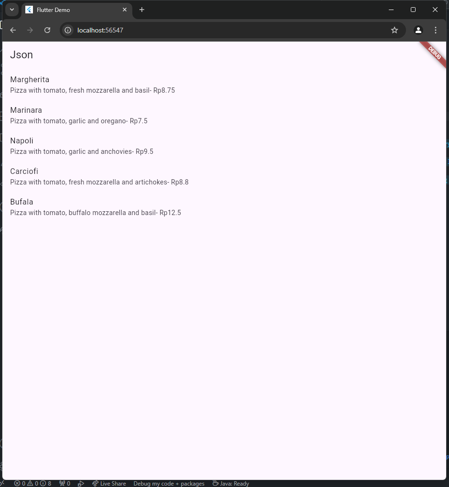

## Praktikum 2

1. Masuk ke layanan Lab Mock di https://app.wiremock.cloud/ dan klik bagian Stubs,
   kemudian, buatlah stub baru.
2. Lengkapi isian seperti gambar berikut:
   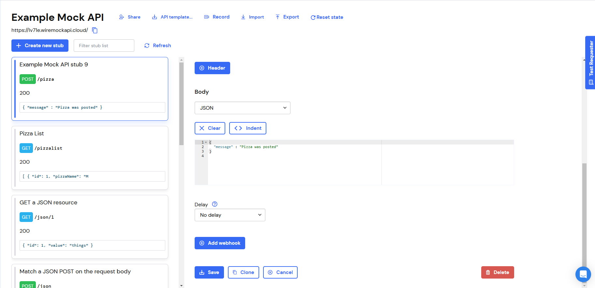
3. simpan
4. Di proyek Flutter, di file httpHelper.dart, di kelas HttpHelper, buat metode baru bernama
   postPizza, lengkapi kode sebagai berikut.
   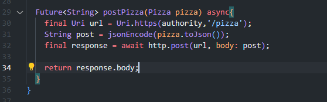
5. Di dalam proyek, buat sebuah file baru bernama pizza_detail.dart.
6. Di bagian atas file baru, tambahkan impor yang diperlukan.
   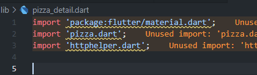
7. Buat StatefulWidget bernama PizzaDetailScreen.
   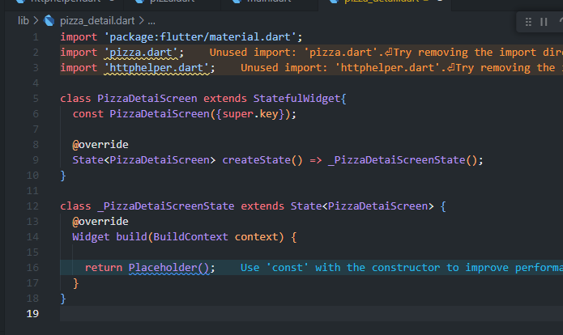
8. Di bagian atas kelas \_PizzaDetailScreenState, tambahkan lima widget
   TextEditingController. Widget ini akan berisi data untuk objek Pizza yang akan diposting
   nanti. Juga, tambahkan sebuah String yang akan berisi hasil dari permintaan POST.
   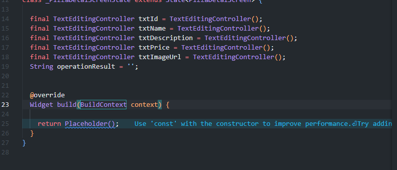
9. Override metode dispose() untuk membuang controllers
   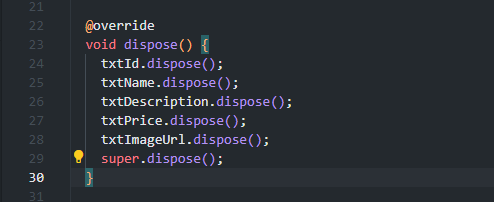
10. Dalam metode build() pada kelas, kita return sebuah Scaffold, yang AppBar-nya berisi Teks
    yang menyatakan “Detail Pizza” dan Body-nya berisi Padding dan SingleChildScrollView
    yang berisi Column.
    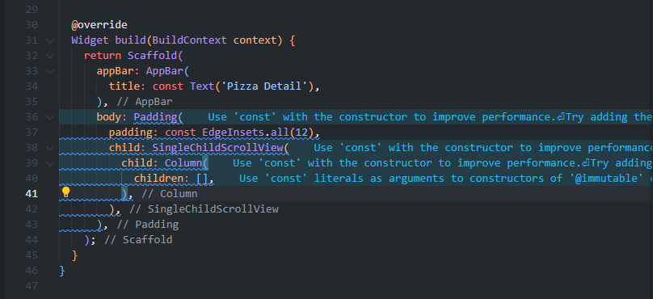
11. Untuk properti anak dari Column, tambahkan beberapa Text yang akan berisi hasil posting,
    lima TextFields, masing-masing terikat pada TextEditingController, dan sebuah
    ElevatedButton untuk menyelesaikan aksi POST (metode postPizza akan dibuat
    berikutnya). Juga, tambahkan SizedBox untuk memberi jarak pada widget di layar.
    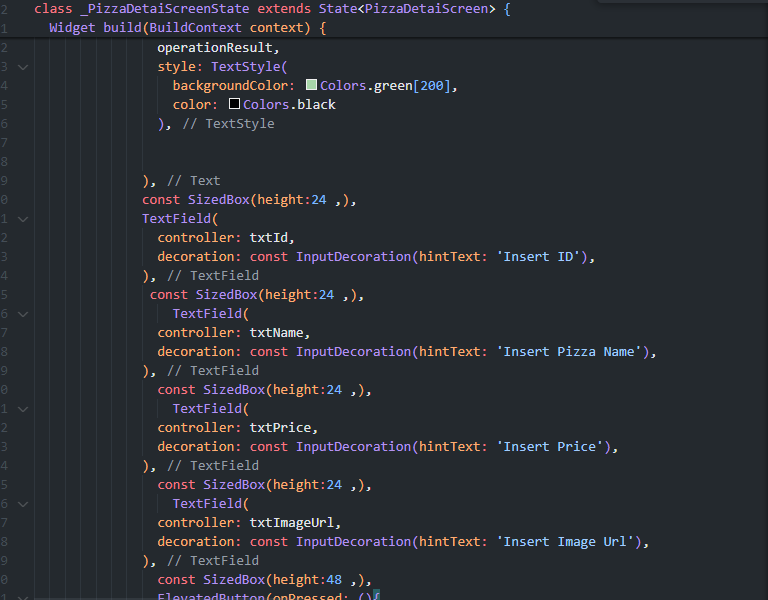
12. Di bagian bawah kelas \_PizzaDetailState, tambahkan metode postPizza.
    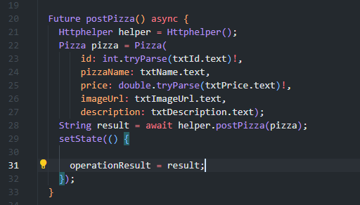
13. Di file main.dart, impor file pizza_detail.dart.
14. Di perancah metode build() dari kelas \_MyHomePageState, tambahkan
    FloatingActionButton yang akan menavigasi ke rute PizzaDetail.
    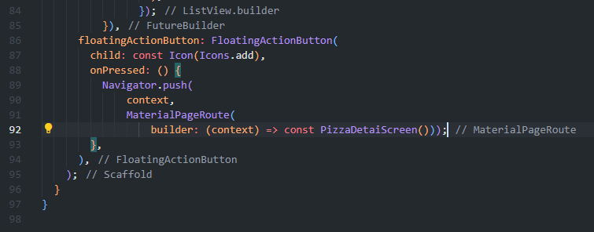
15. Jalankan aplikasi. Pada layar utama, tekan FloatingActionButton untuk menavigasi ke rute
    PizzaDetail
16. Tambahkan detail pizza di kolom teks dan tekan tombol Kirim Postingan. Anda akan
    melihat hasil yang berhasil, seperti yang ditunjukkan pada gambar berikut.
    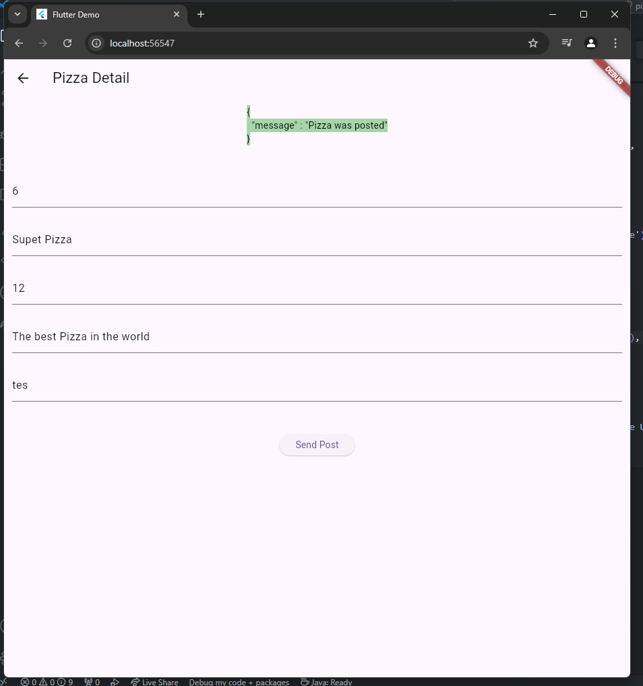

## Praktikum 3

1. Masuk ke layanan Lab Mock di https://app.wiremock.cloud/ dan klik bagian Stubs,
   kemudian, buatlah stub baru.
2. Lengkapi isian seperti gambar berikut:
   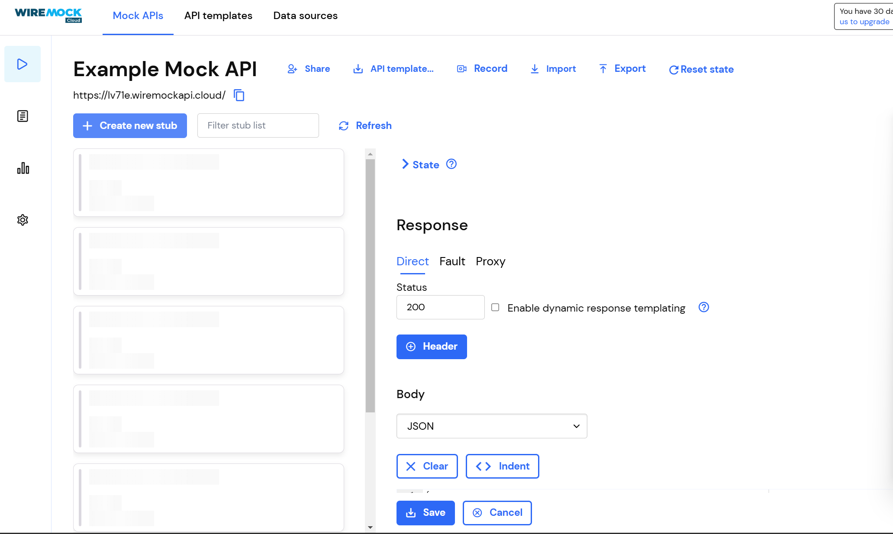
3. Simpan
4. Di proyek Flutter, tambahkan metode putPizza ke kelas HttpHelper di file http_helper.dart
   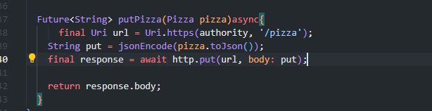
5. Di kelas PizzaDetailScreen di file pizza_detail.dart, tambahkan dua properti, Pizza dan
   boolean, dan di konstruktor, atur dua properti tersebut
   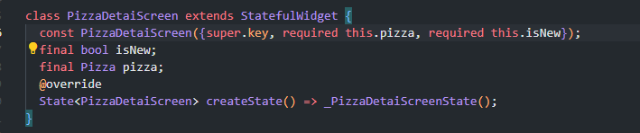
6. Di kelas PizzaDetailScreenState, override metode initState. Bila properti isNew dari kelas
   PizzaDetail tidak baru, properti ini akan menetapkan konten TextFields dengan nilai objek
   Pizza yang dilewatkan
   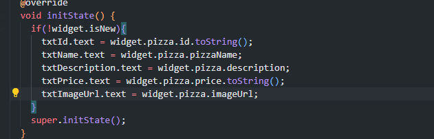
7. Edit metode savePizza sehingga memanggil metode helper.postPizza ketika properti
   isNew bernilai benar, dan helper.putPizza ketika bernilai salah
   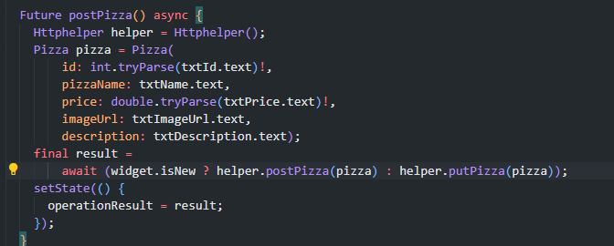
8. Di file main.dart, di metode build \_MyHomePageState, tambahkan properti onTap ke
   ListTile sehingga saat pengguna mengetuknya, aplikasi akan mengubah rute dan
   menampilkan layar PizzaDetail, dengan menampilkan data pizza yang ada saat ini dan
   menjadikan false untuk parameter isNew
9. Di floatingActionButton, passing data Pizza baru dan menjadikan true untuk parameter
   isNew ke rute PizzaDetail
   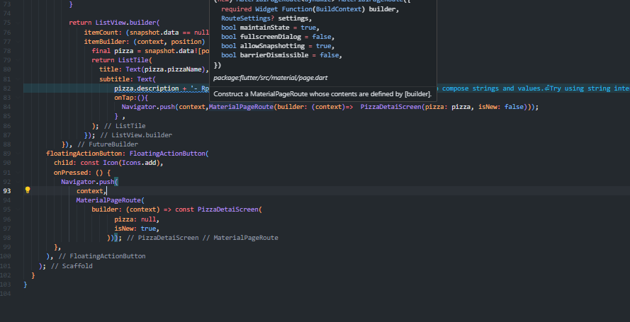
10. Jalankan aplikasi. Pada layar utama, ketuk Pizza mana pun untuk menavigasi ke rute
    PizzaDetail
11. Edit detail pizza di kolom teks dan tekan tombol Simpan. Anda akan melihat pesan yang
    menunjukkan bahwa detail pizza telah diperbarui
    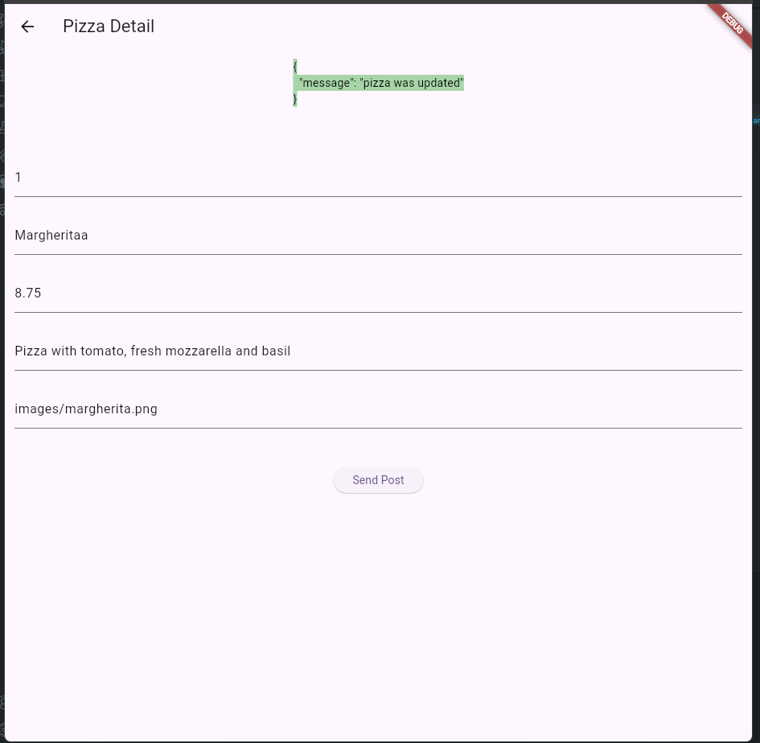

## Praktikum 4

1. Masuk ke layanan Wiremock di https://app.wiremock.cloud dan klik pada bagian Stubs
   pada contoh API. Kemudian, buatlah sebuah stub baru
2. Lengkapi isian, dengan data berikut:
   • Name: Delete Pizza
   • Verb: DELETE
   • Address: /pizza
   • Status: 200
   • Body Type: json
   • Body: {"message": "Pizza was deleted"}
   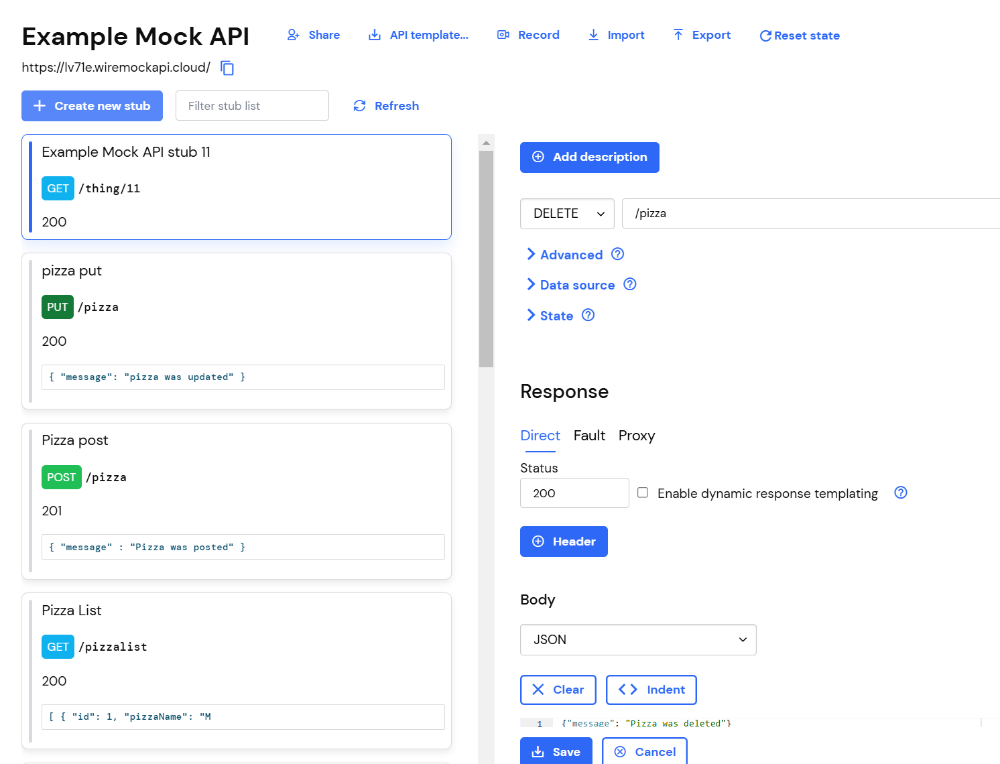
3. Save the new stub
4. Di proyek Flutter, tambahkan metode deletePizza ke kelas HttpHelper di file
   http_helper.dart
   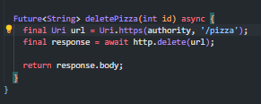
5. Pada file main.dart, di metode build kelas \_MyHomePageState, refaktor itemBuilder dari
   ListView.builder agar ListTile terdapat dalam widget Dismissible, seperti berikut
   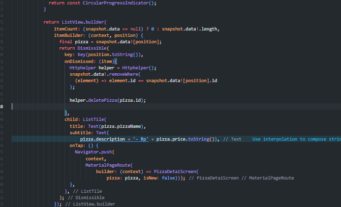
6. Jalankan aplikasi. Saat Anda menggeser elemen apa pun dari daftar pizza, ListTile akan
   menghilang
   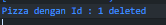
   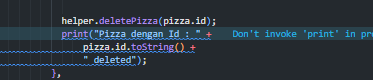
