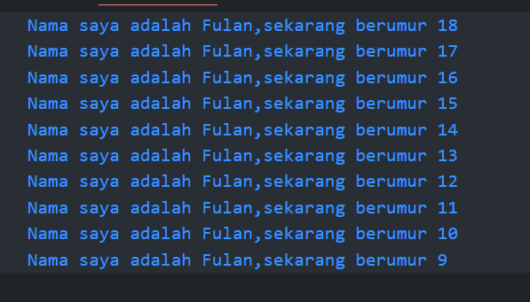

# Pertemuan 1

## Soal no 1

### Source Code

```dart
void main() {
  int age = 18;
  for(int i =0;i<10;i++){
print('Nama saya adalah Fulan,sekarang berumur ${age}');
    age--;
  }
}

```



## Soal no 2

Karena framework flutter menggunakan dart sebagai bahasa pemrograman, sebelum memahami flutter, kita harus mempelajari dasar dari framework itu sendiri yaitu bahasa dart.

## Soal no 3

[File Laporan](3C_12_Krisna%20Andika%20Wijaya.pdf)
