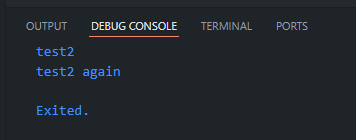
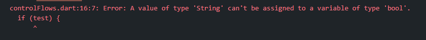
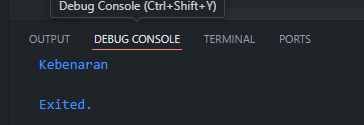
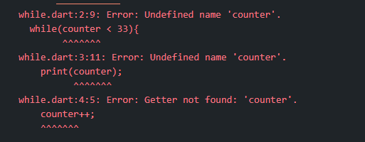
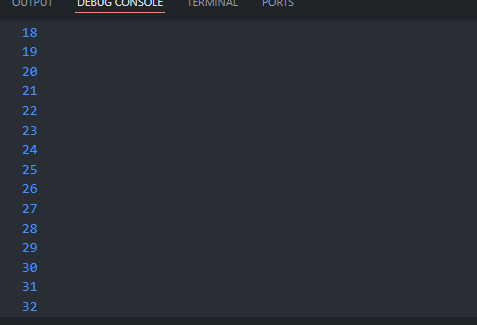
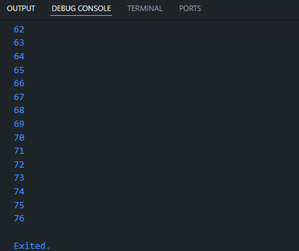
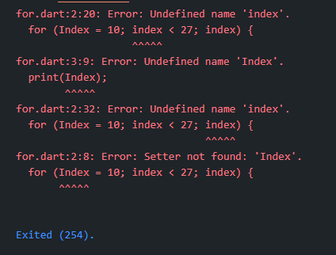
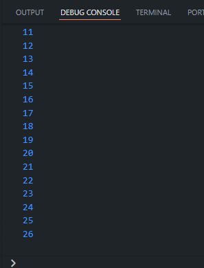
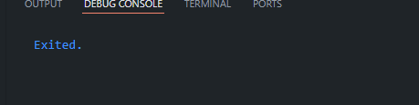
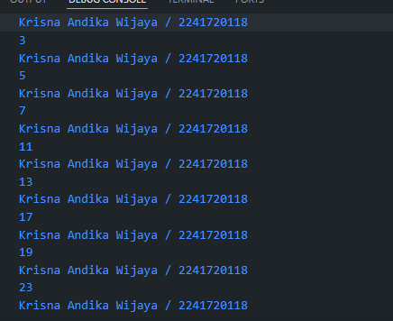

## Nama : Krisna Andika Wijaya

## Nim : 2241720118

# Pertemuan 2

## Praktikum 1: Menerapkan Control Flows ("if/else")

1. Ketik atau salin kode program berikut ke dalam fungsi main().

```dart
String test = "test2";

  if (test == "test1") {
    print("test1");
  } else if (test == "test2") {
    print("test2");
  } else {
    print("something else");
  }

  if (test == "test2") print("test2 again");
```

2. Silakan coba eksekusi (Run) kode pada langkah 1 tersebut. Apa yang terjadi? Jelaskan!
   

> Pada conditional berikut dicek apakah variabel test sama dengan "test 1" apabila salah maka akan di cek lagi apakah variabel test sama dengan "test2" karena sesuai maka program menjalankan perintah pada statementnya.
> lalu setelah itu program melakukan pengecekan apakah test sama dengan "test2" karena benar maka program akan menjalankan perintah `print("test2 again");`

3. Tambahkan kode program berikut, lalu coba eksekusi (Run) kode Anda.

```dart
 String test = 'true';

  if (test) {
    print('Kebenaran');
  }
```

### Hasil execute



> error disebabkan karena variabel tersebut mempunyai tipe data String, sedangkan untuk pengecekan diperlukan tipe data boolean.

### perbaikan

```dart
  bool test = true;

  if (test) {
    print('Kebenaran');
  }

```

### hasil execute



## Praktikum 2: Menerapkan Perulangan "while" dan "do-while"

1. ketik atau salin kode program berikut ke dalam fungsi `main()`

```dart
void main(){
  while(counter < 33){
    print(counter);
    counter++;
  }
}
```

2. Silahkan coba eksekusi kode pada langkah 1 berikut. apa yang terjadi ? jelaskan! lalu perbaiki jika terjadi error.
   

### Perbaiki

```dart
void main(){
  int counter = 0;
  while(counter < 33){
    print(counter);
    counter++;
  }
}
```



> program akan menentukan apakah counter memenuhi syarat jika true, maka program akan mengulang, perulangan harus memilki ujung atau saat persyaratannya menjadi false, maka itu perlu adanya increment pada statement program.

3. Tambahkan kode program berikut, lalu coba eksekusi (Run) kode Anda.

```dart
do {
  print(counter);
  counter++;
} while (counter < 77);
```

### Hasil Output



> penggunaan Do while, maka program akan melakukan satu kali lalu mengecek apakah persyaratan terpenuhi untuk melanjutkan perulangan.

## Praktikum 3: Menerapkan Perulangan "for" dan "break-continue"

1. Ketik atau salin kode berikut ke dalam fungsi `main()`

```dart
for (Index = 10; index < 27; index) {
  print(Index);
}
```

2. Silakan coba eksekusi (Run) kode pada langkah 1 tersebut. Apa yang terjadi? Jelaskan! Lalu perbaiki jika terjadi error.
   

### Perbaikan

```dart
for (int index = 10; index < 27; index++) {
  print(index);
}
```

> pada error ditulis bahwa variabel index belum di buat, karena terjadi typo Index dan belum di instansiasi, lalu pada perualangan tersebut tidak ada increment pada variabel index, sehingga program akan infinte looping
> 

3. Tambahkan kode program berikut di dalam for-loop, lalu coba eksekusi (Run) kode Anda.

```dart
for (int index = 10; index < 27; index++) {
if (index == 21) break;
else if (index > 1 || index < 7) continue;
print(index);
}
```



> saat index == 21 maka program akan berhenti mengulang, dan apabila index lebih dari satu atau kurang dari 7 maka program akan menghentikan perulangan dan menlanjutkan pada perulangan selanjutnya.

# Tugas Praktikum

Buatlah sebuah program yang dapat menampilkan bilangan prima dari angka 0 sampai 201 menggunakan Dart. Ketika bilangan prima ditemukan, maka tampilkan nama lengkap dan NIM Anda.

```dart
bool isPrime(int number) {
  for (var j = 2; j < number; j++) {
    if (number % j == 0) {

      return true;
    }
  }
  return false;
}

void main() {
  for (var i = 0; i <= 201; i++) {
    if (i <= 1) {
      continue;
    }
    if (i == 2) {
      print('Krisna Andika Wijaya / 2241720118');
      continue;
    }
    if (!isPrime(i)) {
      print(i);
      print('Krisna Andika Wijaya / 2241720118');
    }
  }
}

```


