# Laporan Praktikum Pertemuan 4

## Praktikum 1

1. Langkah 1

   ```dart
   var list = [1, 2, 3];
   assert(list.length == 3);
   assert(list[1] == 2);
   print(list.length);
   print(list[1]);

   list[1] = 1;
   assert(list[1] == 1);
   print(list[1]);
   ```

2. Langkah 2
   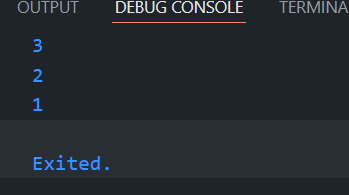

   - pendeklarasian list

   ```dart
   var list = [1,2,3];
   ```

   - Mengecek apakah benar

   ```dart
   assert(list.length == 3); // apakah panjang dari list adalah 3
   assert(list[1] == 2); // apakah list pada index ke-1 adalah 2
   ```

   - Manipulasi list

   ```dart
   list[1] = 1; // merubah nilai pada index ke-1 menjadi 1
   ```

3. Langkah 3
   Ubah kode pada langkah 1 menjadi variabel final yang mempunyai index = 5 dengan default value = null. Isilah nama dan NIM Anda pada elemen index ke-1 dan ke-2. Lalu print dan capture hasilnya.
   ```dart
   final namaNim = List<String?>.filled(5,null);
   namaNim[1] = 'Krisna';
   namaNim[2] = '2241720118';
   ```

## Praktikum 2

1. Langkah 1
   ```dart
   var halogens = {'fluorine', 'chlorine', 'bromine', 'iodine', 'astatine'};
   print(halogens);
   ```
2. Langkah 2
   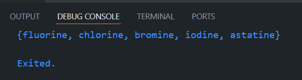
   - Pendeklarasian Set
   ```dart
   var halogens = {'fluorine', 'chlorine', 'bromine', 'iodine', 'astatine'};
   ```
3. Langkah 3

   ```dart
   var names1 = <String>{};
   Set<String> names2 = {}; // This works, too.
   var names3 = {}; // Creates a map, not a set.

   print(names1);
   print(names2);
   print(names3);
   ```

   ```dart
   names1.add('Krisna')
   names1.add('2241720118')
   names2.addAll({'Krisna','2241720118'})
   ```

   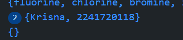

## Praktikum 3

1.  Langkah 1

    ```dart
    var gifts = {
     // Key:    Value
     'first': 'partridge',
     'second': 'turtledoves',
     'fifth': 1
    };

    var nobleGases = {
      2: 'helium',
      10: 'neon',
      18: 2,
    };

    print(gifts);
    print(nobleGases);
    ```

2.  Langkah 2
    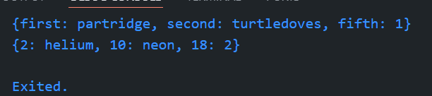

        Jelaskan :
        - Instansiasi maps
        ```dart
        var gifts = {
         // Key:    Value
         'first': 'partridge',
         'second': 'turtledoves',
         'fifth': 1
        };

        var nobleGases = {
          2: 'helium',
          10: 'neon',
          18: 2,
        };
        ```

    > Pada maps terdapat key dan value seperti {'first':'partridge'} berbeda dengan set yang harus mempunyai tipe data yang sama, maps bisa berisi beberapa variabel dengan tipe data yang berbeda.

3.  Langkah 3

```dart
gifts.addAll({'Nim':'2241720118','nama':'krisna'});
nobleGases.addAll({1:'2241720118',2:'krisna'});
mhs1.addAll({'Nim':'2241720118','nama':'krisna'});
mhs2.addAll({1:'2241720118',2:'krisna'});
```

## Praktikum 4

1. Langkah 1

```dart
var list = [1, 2, 3];
var list2 = [0, ...list];
print(list);
print(list2);
print(list2.length);
```

2. Langkah 2
   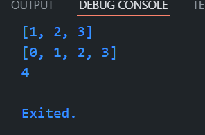

- membuat list yang mengandung list
  ```dart
  var list = [1, 2, 3];
  var list2 = [0, ...list]; // output : [0,1,2,3]
  ```

3. Langkah 3

```dart
var list1 = [1, 2, null];
print(list1);
var list3 = [0, ...list1];
print(list3.length);
```

> Dalam list bisa mengandung null dan memuatnya tanpa harus membuat variabel yang nullable

```dart
var nimNama = ['krisna','2241720118'];
var mahasiswa = ['3C',...nimNama];
```

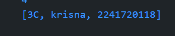 4. Langkah 4

```dart
var nav = ['Home', 'Furniture', 'Plants', if (promoActive) 'Outlet'];
print(nav);
```

hasil jika true :
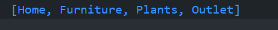

Hasil jika false :
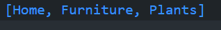

5. Langkah 5
   jika login = Manager
   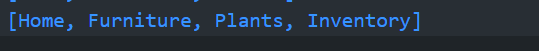
   Jika login lain
   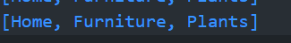

6. Langkah 6

```dart
var listOfInts = [1, 2, 3];
var listOfStrings = ['#0', for (var i in listOfInts) '#$i'];
assert(listOfStrings[1] == '#1');
print(listOfStrings);
```

Hasil :
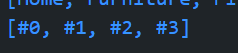

> dalam kasus ini mirip dengan if namun menggunakan for, sehingga daata yang ada pada listOfInts dapat dimasukkan dan dimanipulasi agar mereturn menjadi data tertentu

## Praktikum 5

1. Langkah 1

```dart
var record = ('first', a: 2, b: true, 'last');
print(record);
```

2. Langkah 2
   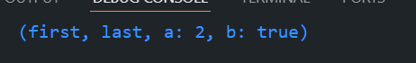
   record memiliki fungsi yang hampir sama dengan collections yang lainnya. Namun record dapat menggabungkan dari map atau list. Namun record bersifat fix length.

> Record berfungsi untuk menggabungkan beberapa variabel

3. Langkah 3

```dart
var tes = (1,2);
print(tukar(tes));
```

hasil :
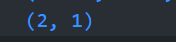

4. Langkah 4

```dart
(String, int) mahasiswa;
mahasiswa = ('krisna',2241720118);
print(mahasiswa);
```

Hasil
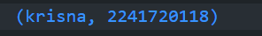

5. Langkah 5
   Records bersifat immutable jadi tidak bisa diganti.

# Tugas Praktikum

1. Jelaskan yang dimaksud Functions dalam bahasa Dart!
   Dalam Dart, functions adalah blok kode yang melakukan tugas tertentu dan dapat dipanggil untuk menjalankan tugas tersebut kapan saja dalam program. Functions membantu mengorganisir kode dengan membuatnya lebih modular dan reusable.
2. Jelaskan jenis-jenis parameter di Functions beserta contoh sintaksnya!

- Positional Parameters (Parameter Posisi): Harus dipanggil sesuai urutan.
  ```dart
  void printMessage(String message, int times) {
    for (int i = 0; i < times; i++) {
      print(message);
    }
  }
  ```
- Optional Positional Parameters: Parameter yang opsional dan tidak harus selalu diberikan.
  ```dart
      void greet([String name = 'Guest']) {
       print('Hello, $name!');
      }
  ```
- Named Parameters: Parameter dengan nama yang harus disertakan saat memanggil fungsi. Ini juga bisa opsional.
  ```dart
      void printUserInfo({String name, int age}) {
       print('Name: $name, Age: $age');
      }
  ```
- Default Parameters: Nilai default yang digunakan jika parameter tidak disertakan.
  ```dart
  void printInfo({String name = 'Guest', int age = 18}) {
   print('Name: $name, Age: $age');
  }
  ```

3. Jelaskan maksud Functions sebagai first-class objects beserta contoh sintaknya!

   > Dart menganggap functions sebagai first-class objects, yang artinya fungsi dapat disimpan dalam variabel, dikirim sebagai argumen, atau dikembalikan oleh fungsi lain.

   ```dart
   void sayHello() {
     print('Hello!');
   }

   void executeFunction(void Function() function) {
     function(); // Memanggil fungsi yang diterima sebagai argumen
   }

   void main() {
     var myFunction = sayHello;
     executeFunction(myFunction); // Menjalankan fungsi yang disimpan di variabel
   }
   ```

4. Apa itu Anonymous Functions? Jelaskan dan berikan contohnya!

   > Anonymous functions (fungsi anonim) adalah fungsi yang tidak memiliki nama. Mereka biasanya digunakan sebagai argumen dalam fungsi lain.

   ```dart
       var numbers = [1, 2, 3, 4];
       numbers.forEach((number) {
       print(number * 2); // Fungsi anonim untuk mengalikan setiap elemen
       });
   ```

5. Jelaskan perbedaan Lexical scope dan Lexical closures! Berikan contohnya!

   > Lexical Scope mengacu pada aturan bagaimana variabel dicari dalam kode. Dart menggunakan lexical scoping, artinya ruang lingkup variabel ditentukan oleh lokasi fungsi dalam kode.

   ```dart
       int x = 10;

       void printX() {
       print(x); // Mengakses variabel x dari lingkup luar
       }
   ```

   > Lexical Closures adalah kemampuan fungsi untuk "menutup" atau menyimpan referensi ke variabel-variabel dari lingkup di mana ia dideklarasikan, meskipun fungsi tersebut dieksekusi di luar lingkupnya.

   ```dart
   Function makeMultiplier(int factor) {
     return (int value) => value * factor; // Mengakses variabel 'factor'
   }

   void main() {
     var triple = makeMultiplier(3);
     print(triple(4)); // Output: 12
   }
   ```

6. Jelaskan dengan contoh cara membuat return multiple value di Functions!

   > Dalam Dart, kita tidak dapat mengembalikan beberapa nilai secara langsung. Namun, kita bisa menggunakan beberapa pendekatan seperti mengembalikan nilai dalam bentuk list atau map, atau menggunakan tuple tidak resmi dengan class atau struct.

   ```dart
   List<int> calculateNumbers(int a, int b) {
     return [a + b, a - b]; // Mengembalikan dua nilai dalam bentuk list
   }

   void main() {
     var results = calculateNumbers(5, 3);
     print('Sum: ${results[0]}, Difference: ${results[1]}');
   }
   ```
