# Pertemuan 5

## Praktikum 1

1. Langkah 1, membuat projek baru dengan flutter
   
2. Langkah 2, menyimpan file flutter pada directory
   
3. Langkah 3 , Memberi nama file project
   
4. Langkah 4
   

## Praktikum 2

1. Commit ke repository
   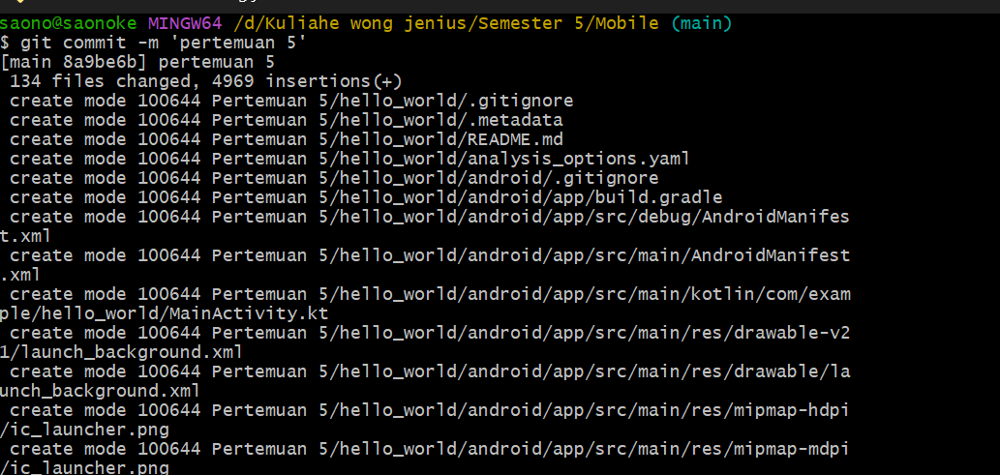
2. Push ke repository
   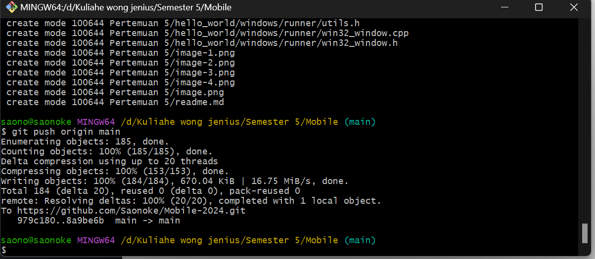
3. Repository Github
   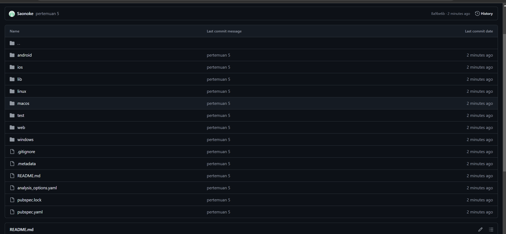

## Praktikum 3

1. Text Widget
   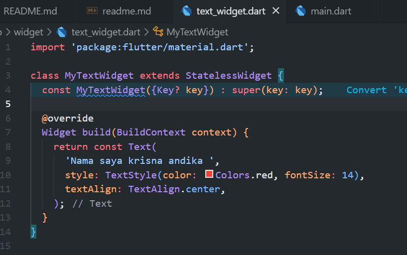
2. import ke main
   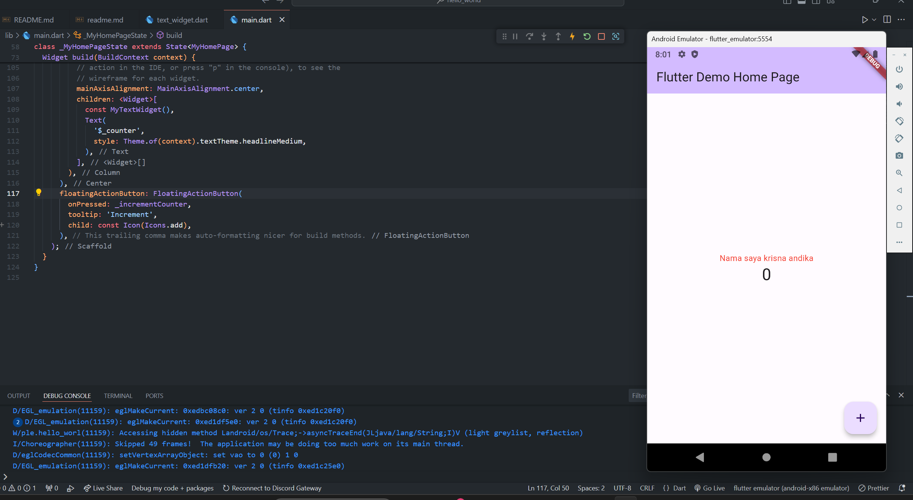
3. Image Widget
   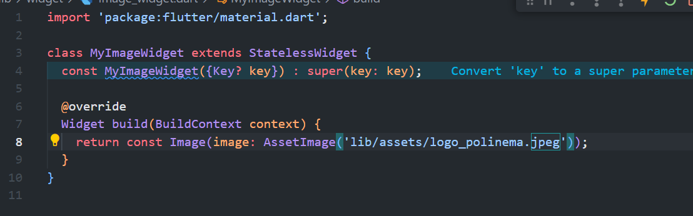
   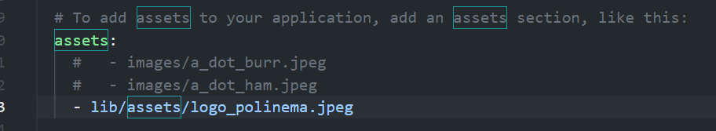
   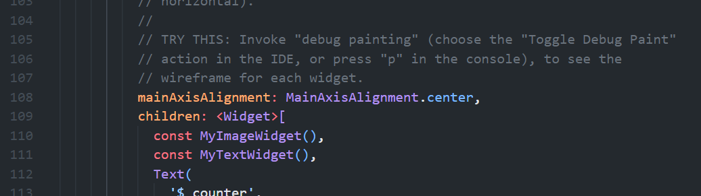
   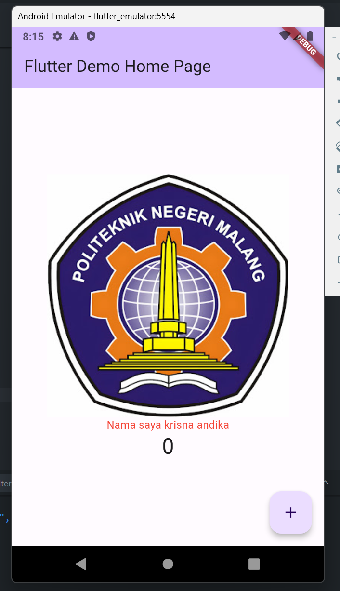

## Praktikum 4

1. Loading cupertino
   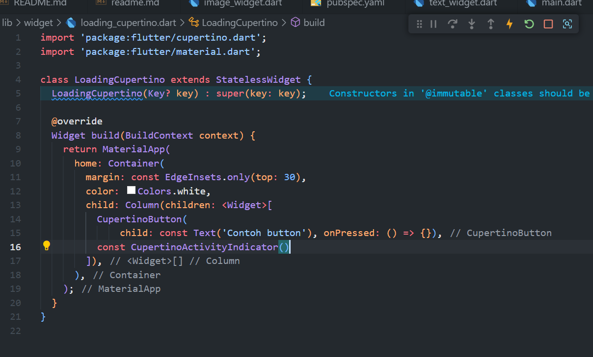
2. Floating action button
   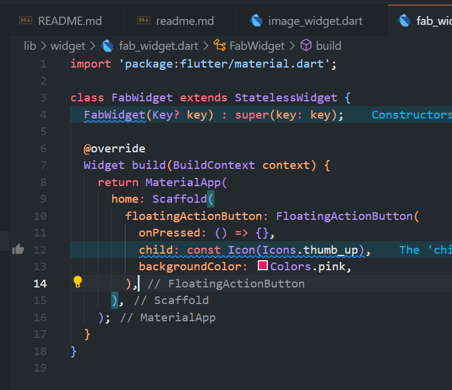
3. Scaffold Widget
   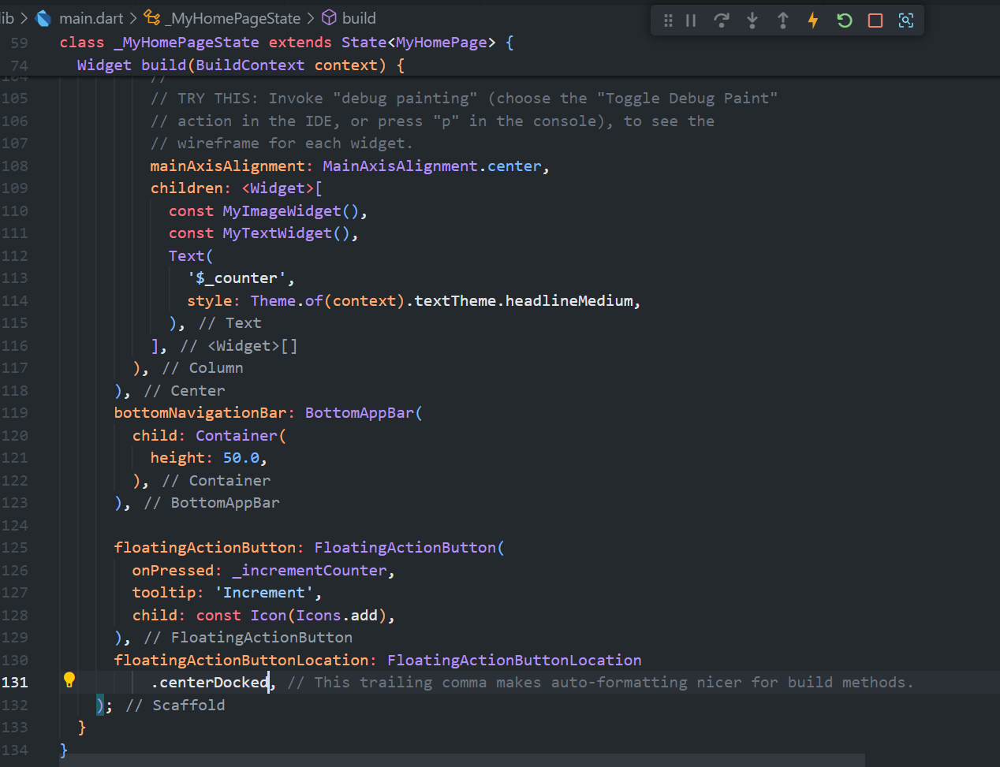
4. Dialog Widget
   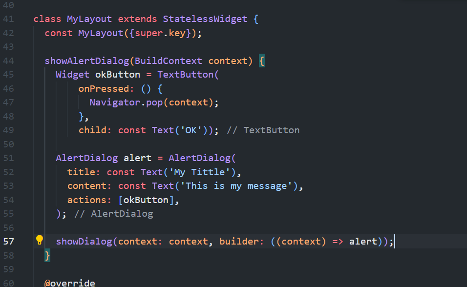
   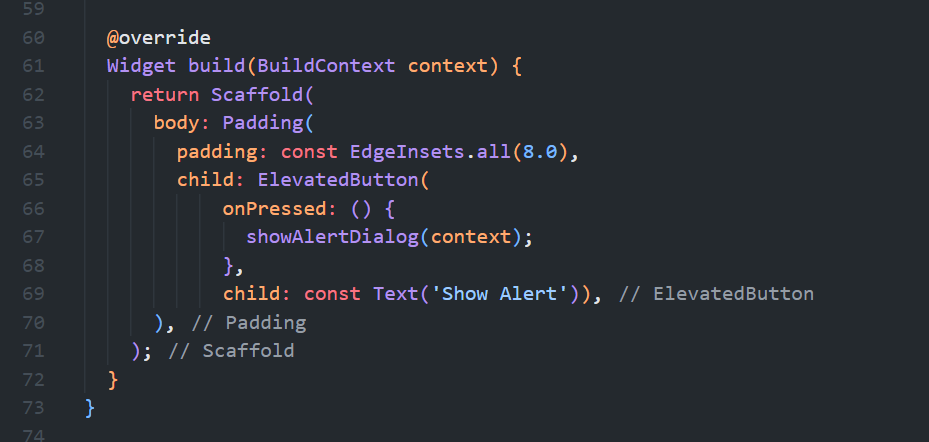
5. Input and selection widget
   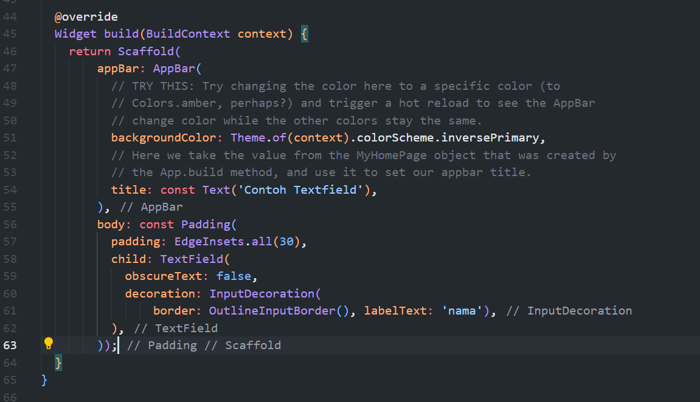
   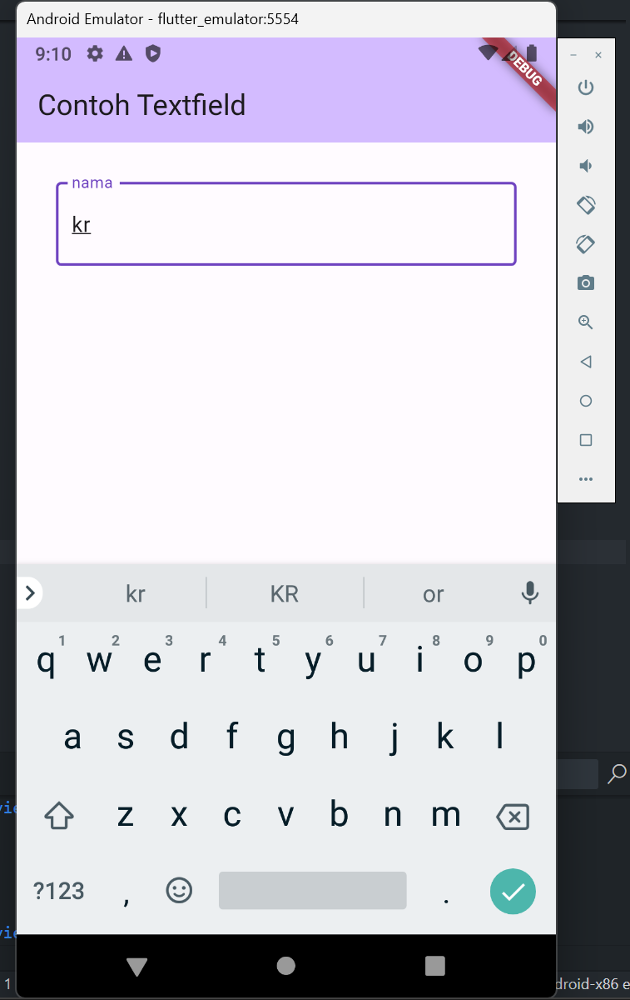
6. date and time pickers
   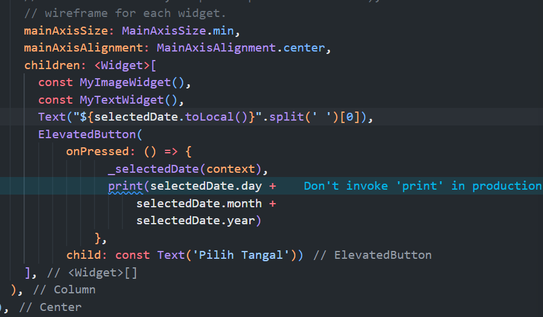
   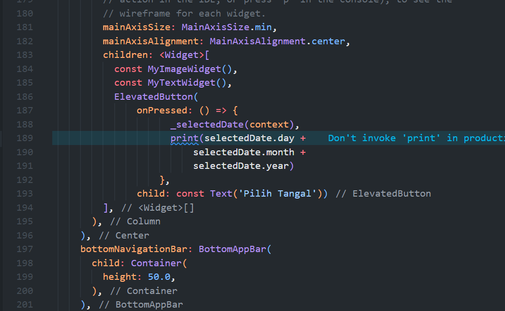
   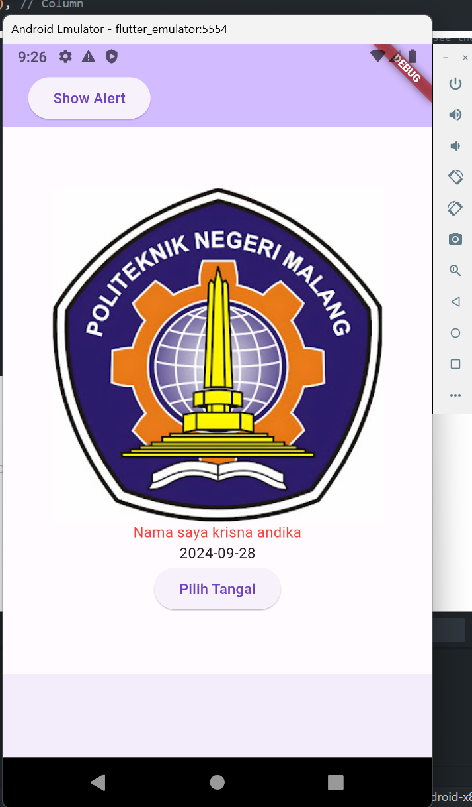
