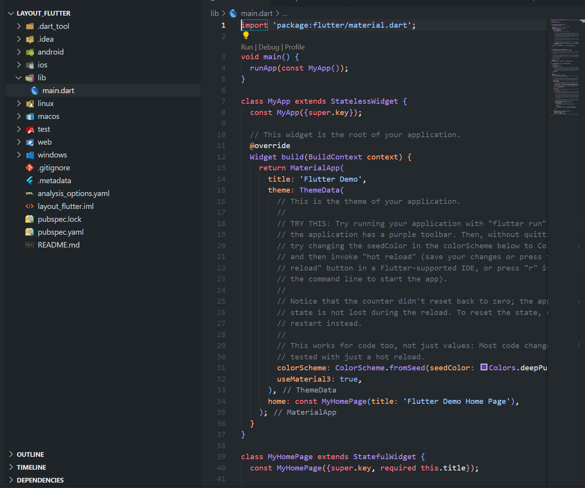
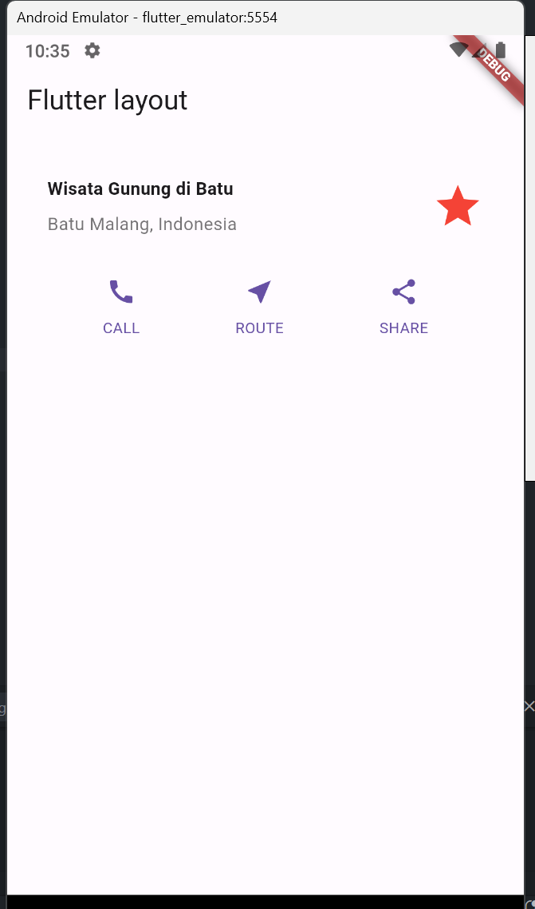

# Pertemuan 6

## Praktikum 1

1. Buat Project Baru
   
2. Buka file lib/main.dart
   
   
3. Identifikasi Layout diagram
4. Implementasi title row
   
   

# Praktikum 2

1. Buat method column \_buildButtonColumn
   
2. Buat Widget buttonSection
   
3. Tambah button section ke body
   
   

# Praktikum 3

1. Buat widget TextSection
   
2. Tambahkan variabel text section ke body
   
   

# Praktikum 4

1. Siapkan aset gambar
   
2. Tambahkan gambar ke body
   
   
3. Terakhir , ubah menjadi ListView
   
