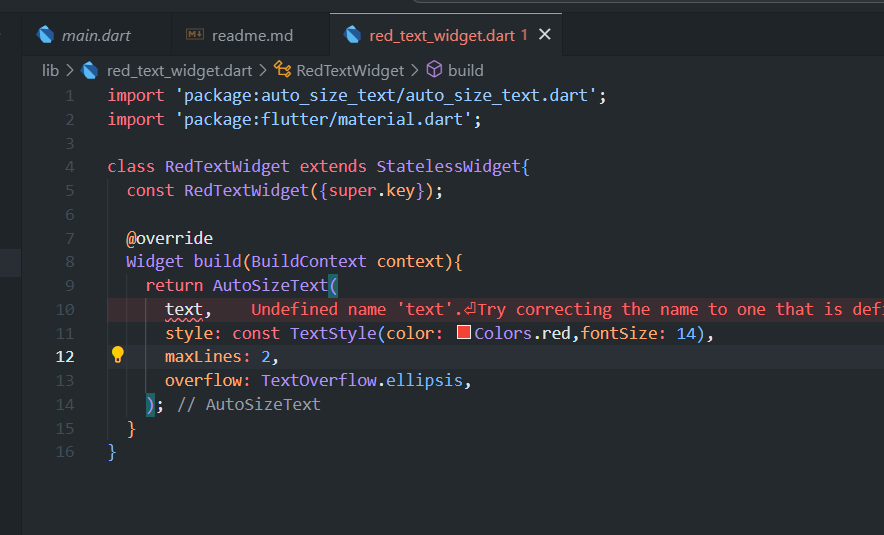

# Pertemuan 7
## Praktikum 7
1. Buat project baru

2. Menambahkan plugin

3. Langkah 3: Buat file red_text_widget.dart

4. Tambah widget autosize text

5. Buat varibel text dan parameter constructor 

6. Tambahkan widget di main.dart


## Tugas Praktikum
2. Jelaskan maksud dari langkah 2 pada praktikum tersebut
Menambahkan plugin atau package eksternal dengan menggunakan terminal : 
```dart
pub get 
```

3. Jelaskan maksud dari langkah 5 pada praktikum tersebut
Menggunakan plugin autosized text, serta mengatur style teks yang akan digunakan nanti sebagai widget.

4. pada langkah 6 terdapat dua widget yang ditambahkan, jelaskan fungsi dan perbedannya
```dart
 Container(
              color: Colors.yellowAccent,
              width: 50,
              child: const RedTextWidget(
                  text: 'You have pushed the button this many times:'),
            ),
```
jawaban : menyiapkan ukuran kotak dengan lebar 50 pixel, dengan child RedTextWidget dengan isi text berupa string.

```dart
 Container(
              color: Colors.greenAccent,
              width: 100,
              child: const RedTextWidget(
                  text: 'You have pushed the button this many times:'),
            )
```
jawaban : menyiapkan ukuran kotak dengan lebar 100 pixel, dengan child RedTextWidget dengan isi text berupa string.

> Perbedaannya terdapat pada lebar containernya yang menjadikan text yang ditampilkan mengikuti lebar dari containernnya sehingga lebar pada container dengan width 100 menampilkan teks yang lebih banyak dari lebar 50

5. Jelaskan maksud dari tiap parameter yang ada di dalam plugin auto_size_text berdasarkan tautan pada dokumentasi ini !

| Parameter  | Deskripsi |
| ------------- | ------------- |
| `key*`  | Mengontrol bagaimana satu widget menggantikan widget lain di pohon. |
| `TextKey`  | Mengatur kunci untuk `Text` widget yang dihasilkan  |
| `Style`  | Jika bukan null, gaya yang akan digunakan untuk teks ini |
| `minFontSize`  | Batasan ukuran teks **minimum** yang akan digunakan saat mengubah ukuran teks secara otomatis. Diabaikan jika `presetFontSizesditetapkan.` |
| `maxFontSize`  | Batasan ukuran teks **maksimum** yang akan digunakan saat mengubah ukuran teks secara otomatis. Diabaikan jika `presetFontSizesditetapkan.`  |
| `stepGranularity`  | Ukuran langkah di mana ukuran font disesuaikan dengan batasan.|
| `presentFontSizes`  |Menentukan terlebih dahulu semua ukuran font yang memungkinkan **Penting:** `presetFontSizes` harus dalam urutan menurun.  |
| `group`  | Sinkronisasikan ukuran beberapa `AutoSizeText` |
| `textAlign*`  | Bagaimana teks harus disejajarkan secara horizontal. |
| `textDirection*`  | Arah teks. Ini menentukan bagaimana textAlignnilai seperti `TextAlign.start` dan `TextAlign.end` diinterpretasikan. |
| `locale*`  | Digunakan untuk memilih font ketika karakter Unicode yang sama dapat ditampilkan secara berbeda, tergantung pada lokal.  |
| `softwrap*`  | 	Apakah teks harus diputus pada jeda baris lunak.  |
| `wrapWords*`  | 	Apakah kata-kata yang tidak muat dalam satu baris harus dibungkus. Defaultnya adalah trueberperilaku seperti Text.  |
| `overflow*`  | Bagaimana luapan visual harus ditangani.  |
| `overflowReplacement*`  | Jika teksnya meluap dan tidak sesuai batasnya, widget ini akan ditampilkan sebagai gantinya.  |
| `textScaleFactor*`  | Jumlah piksel font untuk setiap piksel logis. Juga memengaruhi `minFontSize`, `maxFontSize` dan `presetFontSizes`.  |
| `maxLines*`  | Jumlah baris maksimum opsional untuk teks yang akan direntangkan. |
| `semanticsLabel*`  | Label semantik alternatif untuk teks ini. |


